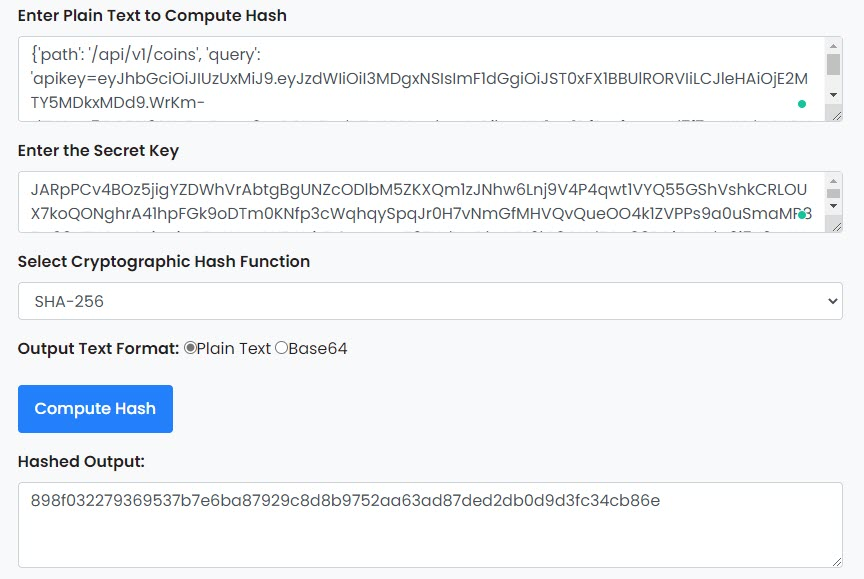
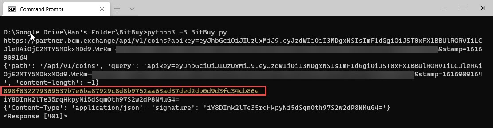

# BitBuy-API-Authentication-Python
This is a POC that convert BitBuy API Authentication Java code to Python 

BitBuy API documents:

https://bitbuy.ca/assets/api/docs/#/?id=partner-api-key-endpoints

I used https://www.devglan.com/online-tools/hmac-sha256-online to verify my HMAC is correct or not.

So My code gave the same Hash value as the website results. But I still have [401] response from the API. 

If anyone can help me figure out what's wrong with my code I'll be very appreciate.

BTW, I tried to contact BitBuy but they refused to suppy any support about their API.
